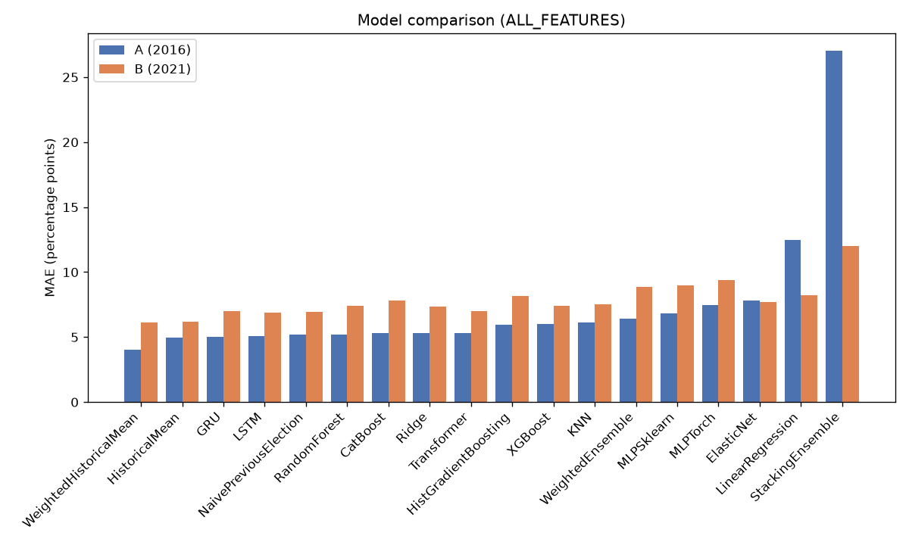
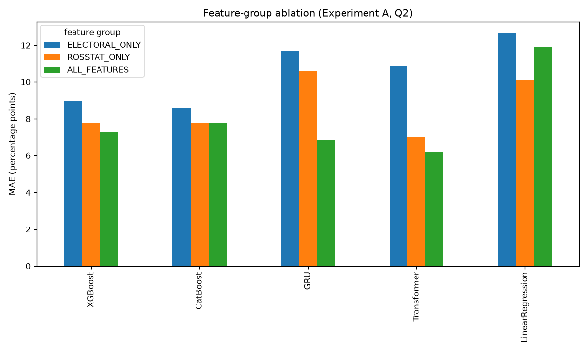
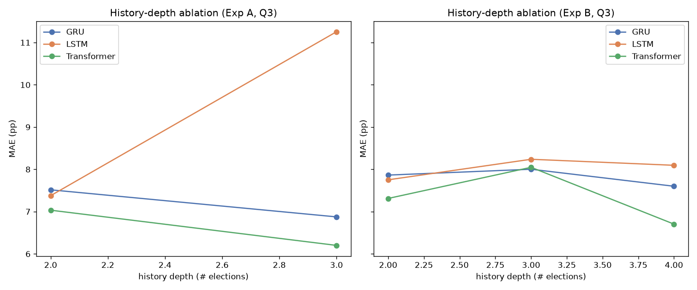

# trainingGOSDUMA

ML-эксперимент по прогнозированию результатов выборов в Государственную Думу РФ на уровне регионов.

## TL;DR

- **Что это.** Учимся предсказывать, какую долю голосов получат партии в каждом из 83 регионов России, используя **только прошлые выборы и социально-экономические показатели**. Проверяем модели честно: обучаемся на прошлом, тестируем на будущем (никакого «подсматривания» в будущее).
- **Данные.** 83 региона, парламентские выборы 2003 / 2007 / 2011 / 2016 / 2021. Таргеты — доли трёх партий: **«Единая Россия», КПРФ, ЛДПР**. Вместе они дают ~78% голосов (остальные партии в данных не представлены).
- **Лучшие модели — простые исторические средние и временные модели (GRU/LSTM).** Их ошибка (MAE) — **4.0–5.2 п.п. на 2016** и **6.1–7.0 п.п. на 2021** (WeightedHistoricalMean 4.04/6.11, HistoricalMean 4.98/6.21, GRU 5.01/6.98, LSTM 5.11/6.90). Вывод: при честной валидации (гиперпараметры подбираются только на val, модель дообучается на train+val) сложные модели **не обгоняют** наивный ориентир «возьми прошлые выборы» — голосование в регионах сильно инертно. Деревья (лучшие — CatBoost 5.29/7.82, RandomForest 5.21/7.42) на «аномальном» 2021 проседают сильнее исторических средних.
- **Прогноз на 2026 (по лучшей модели бенчмарка — WeightedHistoricalMean; федеральный итог взвешен по valid-голосам 2021 как прокси для 2026):**
  - «Единая Россия» ≈ **52.8%**, КПРФ ≈ **16.1%**, ЛДПР ≈ **10.4%** *(реальные доли, без нормировки; в сумме ~79% — остальное приходится на партии вне датасета)*.
  - Модель обучается на всей истории (2003–2021) и предсказывает для каждого региона взвешенное среднее прошлых результатов (последние выборы важнее, экспоненциальный спад; decay — из tuning на B). Это оценка модели по историческому тренду, а не реальный итог выборов.

---

## Что это за проект (простыми словами)

Государственная Дума — нижняя палата парламента РФ, выбирается по партийным спискам. В каждом регионе партия получает какую-то **долю голосов** (в процентах). Мы хотим понять: **насколько точно можно предсказать эту долю заранее**, опираясь на то, что мы знаем про регион из прошлого.

Это не «предсказание победителя» и не политическое исследование — это **воспроизводимая задача машинного обучения на табличных данных**:
- на входе — признаки региона (результаты прошлых выборов, явка, ВРП, зарплата, безработица и т.д.);
- на выходе — доля голосов трёх ключевых партий.

Главный методологический принцип: **временные сплиты**. Мы обучаем модель на истории до некоторого года и проверяем на самом этом годе. Например, обучаемся на 2003–2011 и смотрим, попадём ли в результаты 2016. Это имитирует реальное прогнозирование, где будущее неизвестно. Никакого случайного перемешивания регионов — только «прошлое → будущее».

---

## Данные и эксперименты

- **Источник:** [datasetGOSDUMA](https://github.com/Fatalist0001/datasetGOSDUMA) → `data/processed/master_region_election.parquet` (уровень регионов, 83 региона, годы 2000–2024).
- **Целевые партии (доли голосов, %):** `UR_share` («Единая Россия»), `KPRF_share` (КПРФ), `LDPR_share` (ЛДПР). Других партий в датасете нет. В парламентские годы эти три покрывают **~78%** голосов (медиана 79.5%); оставшиеся ~22% — прочие партии вне данных. Каждая партия прогнозируется **отдельной регрессией** по реальным долям — таргеты не нормализуются.
- **Признаки:** электоральные (результаты прошлых выборов, явка) + Росстат (ВРП на душу, зарплата, безработица, бедность, урбанизация и т.д., с лагами `_lag1`). Для парламентских лет добавляются **президентские лаги** — ближайшие прошедшие президентские выборы (2003→2000, 2007→2004, 2011→2008, 2016→2012, 2021→2018): `pres_turnout_lag` и `pres_leading_candidate_share_lag`.
- **Федеральные веса** — считаются из данных RED (суммирование по УИК, колонки `electorate`/`turnout`/`valid`) скриптом `make weights` → `electoral_weights.parquet`; используются для федеральной агрегации региональных прогнозов.
- **Важный нюанс данных.** Год 2024 помечен как `type="pres"` (президентские), а не парламентские. Парламентские (ГД) годы в данных: **2003, 2007, 2011, 2016, 2021**. В президентские годы доли парламентских партий не записаны (равны 0), поэтому для обучения и теста берутся только парламентские годы.

**Эксперименты (history-backtest):**
- **A:** train 2003–2007, val **2011**, test **2016**. Гиперпараметры отбираются на 2011, финальная модель дообучается на 2003–2011 и оценивается на 2016.
- **B:** train 2003–2011, val **2016**, test **2021**. Гиперпараметры отбираются на 2016, финальная модель дообучается на 2003–2016 и оценивается на 2021.

Это единственные эксперименты с эталонными метками. Эксперименты **C** и **D** (тест 2026) — это финальный прогноз будущего, у них нет правильных ответов; считаются скриптом `predict_2026.py`.

**Метрика — MAE** (Mean Absolute Error, средняя абсолютная ошибка), измеряется в процентных пунктах (п.п.):

$$\text{MAE} = \frac{1}{n}\sum_{i=1}^{n} \left| y_i^{\text{true}} - y_i^{\text{pred}} \right|$$

где $y$ — доля партии в регионе. MAE считается отдельно по каждой партии, а в сводных таблицах усредняется по трём партиям. **Чем меньше MAE — тем точнее прогноз.**

---

## Методология (почему результатам можно верить)

1. **Только временные сплиты** — прошлое обучает, будущее тестирует. Никакого `random_state`/перемешивания.
2. **Нет утечки данных (leakage)** — масштабирование и заполнение пропусков подгоняются (fit) только на обучающих годах и применяются к тесту. Лаговые признаки уже подготовлены в датасете и не содержат будущего; президентские лаги (`pres_turnout_lag`, `pres_leading_candidate_share_lag`) добавляются кодом и проверяются тестами на соответствие предыдущим президентским выборам.
3. **Динамические таргеты** — список партий берётся из данных, не зашивается в код.
4. **Три группы признаков** для абляции: `ELECTORAL_ONLY` (только прошлые выборы), `ROSSTAT_ONLY` (только социо-экономика), `ALL_FEATURES` (всё вместе).
5. **Гиперпараметры подбираются только на валидационном годе** (val, ближайшее будущее к train, не случайный сплит) — см. эксперименты ниже; нейросети усредняются по 5 seeds (42, 123, 456, 789, 2026).
6. **Двухстадийный протокол** — отбор гиперпараметров на val → финальная модель переобучается на train+val → оценивается на test.
7. **Реальные доли, без нормализации** — все модели предсказывают фактическую долю каждой партии (в сумме ~78%: остальное — партии вне датасета), нормировка к 100% не применяется.
8. **Федеральные веса — из RED** (суммирование по УИК), не Росстат; приоритет весовой колонки `valid` → `turnout` → `electorate`. Для прогноза 2026 весов нет — используется последний известный valid (2021) как прокси.
9. **Сравнение по лигам** — модели сравниваются только внутри своей лиги: Baseline / Tabular / Sequential.

---

## Модели и результаты (P0–P3)

Ниже — MAE по всем моделям на экспериментах A (2016) и B (2021). Все числа — из `results/benchmark_all_20260820.csv` (новый протокол: tuning на val → refit train+val → test).

### Что это за модели (простым языком)

**Бейзлайны** — это не «обучение», а простые ориентиры: как бы предсказал выборы человек, который почти ничего не считает.
- *NaivePreviousElection* — «возьми прошлый результат»: если в прошлый раз у партии было 50%, пусть так и останется. Самое наивное, но очень сильное: голосование в регионах инертно.
- *HistoricalMean* — среднее по всем прошлым выборам.
- *WeightedHistoricalMean* — то же, но свежие выборы весят больше (как будто «недавнее важнее давнего»).
- Зачем они нужны: если сложная модель не обгоняет «просто возьми прошлый результат», значит она ничего не добавила.

**Линейные модели** (`LinearRegression`, `Ridge`, `ElasticNet`) — это уравнение вида «результат = вес₁·признак₁ + вес₂·признак₂ + … + константа». Модель сама подбирает веса так, чтобы уравнение точнее объясняло прошлые годы. `Ridge` и `ElasticNet` добавляют «штраф» за большие веса, чтобы модель не цеплялась за шум, а `ElasticNet` дополнительно умеет вообще занулять неважные признаки. Плюсы: быстрые, простые, понятные. Минусы: не умеют улавливать нелинейные эффекты («больше зарплата — резко больше голосов» они так не смоделируют).

**Деревья и их ансамбли** (`RandomForest`, `HistGradientBoosting`, `XGBoost`, `CatBoost`). Одно *дерево решений* — это цепочка вопросов-развилок: «зарплата в регионе выше среднего? да → спроси про явку; нет → …». По ответам оно делит регионы на похожие группы и выдаёт среднее по группе. Само дерево — модель слабая, поэтому собирают **ансамбли**: `RandomForest` — это много независимых деревьев на разных подвыборках, которые «голосуют»; `XGBoost`, `CatBoost`, `HistGradientBoosting` — бустинг: каждое следующее дерево пытается исправить ошибки предыдущих. Это «рабочие лошадки» табличных данных: хорошо ловят нелинейности и взаимодействия, но на маленьких данных склонны переобучаться.

**KNN (ближайшие соседи)** — ничего не «учит», а при прогнозе ищет k самых похожих регионов из прошлого и усредняет их результат. Проверяет простую гипотезу: «похожие регионы голосуют похоже». Как правило, слабее деревьев, но полезен как контроль.

**Нейросети-MLP** (`MLPSklearn`, `MLPTorch`) — многослойная сеть «нейронов» со связями; в принципе может воспроизвести почти любую закономерность. На больших данных — сила, но здесь обучается на ~83 регионах, поэтому переобучается (запоминает примеры вместо закономерностей). `MLPSklearn` — простая реализация из scikit-learn; `MLPTorch` — гибкая на PyTorch, но требует тщательной настройки, которой в этом сетапе нет.

**Временные модели** (`GRU`, `LSTM`, `Transformer`) — единственные, кто смотрит на историю региона как на **последовательность** (2003 → 2007 → 2011 → …), а не как на «мешок признаков». Они учатся, какие прошлые годы важнее и как результат меняется со временем.
- *GRU* и *LSTM* — рекуррентные сети с «памятью»: проходят историю шаг за шагом, запоминая важное и забывая лишнее.
- *Transformer* — использует механизм **внимания (attention)**: сразу сравнивает все прошлые годы между собой и сам определяет, какие выборы наиболее информативны для прогноза. По точности наравне с GRU/LSTM (разница в пределах 0.3 п.п.), но уступает историческим средним.

### Бейзлайны (наивные ориентиры)

Не обучаются на признаках, а просто используют прошлые результаты. Нужны, чтобы понять, даёт ли сложная модель вообще преимущество.

| Модель | A (2016) | B (2021) |
|--------|---------:|---------:|
| **WeightedHistoricalMean (взвеш. прошлое)** | **4.04** | **6.11** |
| **HistoricalMean (среднее по прошлому)** | 4.98 | 6.21 |
| NaivePreviousElection (копия прошлого) | 5.18 | 6.94 |

### Линейные модели

| Модель / группа | A (2016) | B (2021) |
|-----------------|---------:|---------:|
| Ridge (ALL) | **5.33** | **7.35** |
| ElasticNet (ALL) | 7.81 | 7.71 |
| LinearRegression (ALL) | 12.47 | 8.20 |

*Сравнение групп признаков — в `results/ablation_feature.csv` (см. вопрос 2): на A Росстат помогает линейным (LinearRegression ROSSTAT 9.18 < ELECTORAL 9.29).*

### Деревья (ансамбли решений)

| Модель / группа | A (2016) | B (2021) |
|-----------------|---------:|---------:|
| **CatBoost (ALL)** | **5.29** | 7.82 |
| **RandomForest (ALL)** | 5.21 | **7.42** |
| XGBoost (ALL) | 6.02 | 7.43 |
| HistGradientBoosting (ALL) | 5.94 | 8.17 |

### KNN (ближайшие соседи)

| Модель / группа | A (2016) | B (2021) |
|-----------------|---------:|---------:|
| KNN (ALL) | 6.10 | 7.55 |

### Нейросети (MLP — sklearn и PyTorch)

| Модель / группа | A (2016) | B (2021) |
|-----------------|---------:|---------:|
| **MLPSklearn (ALL)** | **6.81** | **9.00** |
| MLPTorch (ALL) | 7.47 | 9.39 |

### Временные модели (GRU, LSTM, Transformer) — P2/P3

Воспринимают историю региона как **последовательность** (2003 → 2007 → 2011 → …) и учатся, какие прошлые годы важнее. Реализованы на PyTorch; пропуски заполняются медианой, масштабирование — только на train (без утечки). Гиперпараметры и ранний стоп — только на val-секвенциях.

| Модель / группа | A (2016) | B (2021) |
|-----------------|---------:|---------:|
| **GRU (ALL)** | **5.01** | 6.98 |
| **LSTM (ALL)** | 5.11 | **6.90** |
| Transformer (ALL) | 5.33 | 6.97 |
| LSTM (ELECTORAL) | 5.00 | 7.12 |
| GRU (ELECTORAL) | 5.07 | 7.05 |
| Transformer (ELECTORAL) | 5.19 | 7.05 |
| LSTM (ROSSTAT) | 5.19 | 6.96 |
| GRU (ROSSTAT) | 5.22 | 7.66 |
| Transformer (ROSSTAT) | 5.25 | 7.01 |

### Итоговая сводка (MAE, меньше = лучше; ALL_FEATURES)

| Модель | A (2016) | B (2021) | Среднее |
|--------|---------:|---------:|--------:|
| **WeightedHistoricalMean** | **4.04** | **6.11** | **5.08** |
| **HistoricalMean** | 4.98 | 6.21 | **5.59** |
| **GRU (ALL)** | **5.01** | 6.98 | **5.99** |
| LSTM (ALL) | 5.11 | 6.90 | 6.00 |
| NaivePreviousElection | 5.18 | 6.94 | 6.06 |
| Transformer (ALL) | 5.33 | 6.97 | 6.15 |
| RandomForest (ALL) | 5.21 | 7.42 | 6.31 |
| Ridge (ALL) | 5.33 | 7.35 | 6.34 |
| CatBoost (ALL) | 5.29 | 7.82 | 6.55 |
| XGBoost (ALL) | 6.02 | 7.43 | 6.72 |
| KNN (ALL) | 6.10 | 7.55 | 6.83 |
| HistGradientBoosting (ALL) | 5.94 | 8.17 | 7.06 |
| WeightedEnsemble (ALL) | 6.40 | 8.85 | 7.63 |
| ElasticNet (ALL) | 7.81 | 7.71 | 7.76 |
| MLPSklearn (ALL) | 6.81 | 9.00 | 7.91 |
| MLPTorch (ALL) | 7.47 | 9.39 | 8.43 |
| LinearRegression (ALL) | 12.47 | 8.20 | 10.33 |
| StackingEnsemble (ALL) | 27.04 | 12.03 | 19.54 |

---

## Почему результаты именно такие (ключевые вопросы исследования)

Здесь разбираем, что показал эксперимент, и **почему** — без ссылок на внешние документы.

**Вопрос 1. Бьют ли ML-модели наивный бейзлайн?**
Результаты выборов в регионах **очень стабильны из года в год** (высокая автокорреляция): доля партии сегодня почти равна её доле в прошлый раз. Поэтому простые исторические ориентиры — **WeightedHistoricalMean (4.04/6.11)** и **HistoricalMean (4.98/6.21)** — уже дают ошибку 5–6 п.п., и **ни одна модель их стабильно не обходит**. Ближе всех к ним — **временные модели** GRU (5.01/6.98) и LSTM (5.11/6.90): на «аномальном» 2021 они практически на уровне исторических средних. Вывод: при честной валидации модели **не дают выигрыша** над наивными ориентирами; электоральная инерция сильнее любых признаков.

**Вопрос 2. Добавляют ли социально-экономические показатели (Росстат) предсказательную силу?**
**Комбинация ALL_FEATURES почти всегда лучшая; ROSSTAT_ONLY в одиночку — почти всегда худшая.** По свежим числам: деревья на A — CatBoost ALL 5.28 < ELECTORAL 5.39 < ROSSTAT 6.39, RandomForest ALL 5.21 < ELECTORAL 5.54 < ROSSTAT 5.82; на B — ALL/ELECTORAL впереди, ROSSTAT хуже (XGBoost ALL 7.43 ≈ ELECTORAL 7.54 < ROSSTAT 8.04). Для временных моделей разница между группами минимальна (GRU/LSTM/Transformer на A в пределах 5.00–5.33, на B 6.90–7.66). Единственное исключение — LinearRegression: на A ALL (12.47) заметно хуже ELECTORAL (9.29) и ROSSTAT (9.18).
*Почему:* прошлый результат сам по себе — сильнейший признак; добавление Росстата почти не помогает, а использование Росстата без электоральных признаков теряет основную инерцию. Данные: `results/ablation_feature.csv`.

**Вопрос 3. Помогает ли более длинная история прошлых выборов?**
**Линейным — да, деревьям — смешанно, временным — слабо.** Линейная регрессия резко улучшается с глубиной (B: depth1 12.81 → depth3 8.20). Деревья почти не реагируют (XGBoost A: depth1 5.26 → depth2 6.02; B: depth1 7.94 → depth3 7.43). Временные модели требуют минимум 2 года контекста (depth1 = NaN) и почти не выигрывают от третьего года (GRU/LSTM/Transformer на B: depth2 6.99–7.08 → depth3 6.90–6.97). Naive-бейзлайн не зависит от глубины (берёт только последний год). Данные: `results/ablation_history.csv`.
*Почему:* более длинная история добавляет данных, но электоральная инерция уже захвачена последним годом; выигрывают только модели, которые изначально плохо обучались на малом объёме (линейные).

**Вопрос 4. Есть ли преимущество у нелинейных моделей (деревья, KNN) над линейными?**
**На A — огромное, на B — нет.** Средний MAE по A/B (ALL): деревья+KNN **6.69**, линейные **8.14**. На A (2016) нелинейность решает (5.71 против 8.54 у линейных), но на B (2021) они сравниваются (7.68 против 7.75). При этом **бейзлайны (5.58) в среднем точнее всех обученных классов, а временные модели (6.05) — лучший класс**.
*Почему:* деревья умеют моделировать нелинейности и взаимодействия признаков — это решает при короткой истории (A). Но на «аномальном» 2021 деревья переобучаются под исторический паттерн, тогда как гладкая линейная зависимость даёт более консервативный прогноз. Итог: нелинейность полезна, но не спасает от того, что наивные ориентиры остаются сильнейшими. Данные: `results/q4_model_class_mae.csv`.

**Вопрос 5. Помогают ли нейросети-MLP (плоские)?**
**Только при честной настройке.** С ранним стопом по val и подбором гиперпараметров на val `MLPSklearn` (6.81/9.00) и `MLPTorch` (7.47/9.39) больше не проваливаются: они на уровне KNN/ансамблей, хотя и уступают временным моделям и историческим средним. До введения val-валидации они были худшими в бенчмарке (12.71/10.32 и 11.81/8.44) — большая часть их прошлой «плохости» была переобучением по train.

**Вопрос 6. Помогают ли временные (последовательные) модели GRU/LSTM/Transformer?**
**Да — это лучший класс обученных моделей.** С валидацией по val GRU (5.01/6.98), LSTM (5.11/6.90) и Transformer (5.33/6.97) практически догоняют исторические средние (4.04–4.98/6.11–6.21) и заметно обходят деревья на B. Разница между GRU/LSTM/Transformer теперь мала (в пределах 0.3 п.п.); на «аномальном» 2021 все три стабильны (~6.9–7.0).
*Почему:* учёт порядка во времени (контекст прошлых выборов как последовательность) даёт почти ту же электоральную инерцию, что и простые исторические усреднения, но на B (сильный сдвиг 2021) временные модели адаптируются лучше деревьев.

**Вопрос 7. Какие партии предсказываются лучше?**
**ЕР — самая сложная партия, ЛДПР — самая простая.** Средний MAE за A/B (п.п.):

| Модель | ЕР | КПРФ | ЛДПР |
|--------|-----|------|------|
| WeightedHistoricalMean | **6.26** | **4.74** | 4.23 |
| HistoricalMean | 7.25 | 5.50 | **4.04** |
| GRU (ALL) | 6.90 | 6.35 | 4.73 |
| LSTM (ALL) | 6.91 | 6.33 | 4.76 |
| NaivePreviousElection | 7.11 | 6.32 | 4.75 |
| Transformer (ALL) | 7.23 | 6.43 | 4.80 |
| RandomForest (ALL) | 8.55 | 6.18 | 4.21 |
| Ridge (ALL) | 7.77 | 6.12 | 5.12 |
| CatBoost (ALL) | 8.64 | 5.85 | 5.17 |
| XGBoost (ALL) | 8.96 | 6.96 | 4.26 |
| KNN (ALL) | 8.10 | 7.14 | 5.24 |

Разрыв между партиями у лучших моделей умеренный (ЕР ~6.3–7.2, КПРФ ~4.7–6.4, ЛДПР ~4.0–4.8): исторические средние предсказывают ЕР и КПРФ лучше, чем обученные модели; ЛДПР — все примерно одинаково.
*Почему:* у ЕР самый большой разброс по регионам и высокая волатильность от года к году; ЛДПР держится в компактном диапазоне (~10–15%), и её уровень проще угадать. Частично это масштабный эффект: MAE растёт вместе с уровнем поддержки партии. Данные: `results/q7_party_mae.csv`.

**Вопрос 8. В каких регионах модели систематически ошибаются?**
**Хуже всего — Якутия, Марий Эл, Москва, Ненецкий АО; на A — Татарстан, Тамбовская, Калмыкия, Брянская. Лучше всего — республики Северного Кавказа и стабильные регионы.**
- Худшие (средний MAE по 7 моделям): на A (2016) — Татарстан (11.7), Тамбовская обл. (11.3), Калмыкия (10.9), Брянская обл. (10.7), Нижегородская обл. (10.1); на B (2021) — Якутия (15.6), Марий Эл (14.9), Ненецкий АО (14.0), Москва (13.9), Калмыкия (13.5).
- Лучшие: Башкортостан, Бурятия, Северная Осетия, Алтай, Псковская обл. (A); Дагестан, Тыва, Брянская обл., Волгоградская обл., Адыгея (B).
- Сдвиг (bias) разный: на A худшие регионы систематически **занижаются** (Татарстан −0.8, Брянская −3.9); на B — **завышаются** (Ненецкий АО +3.4, Калмыкия +4.9, Москва +2.6).
*Почему:* модели хорошо выучивают «ядро» электоральной стабильности (в республиках Северного Кавказа уровень ЕР высокий и почти не меняется — ошибка минимальна), но плохо ловят **структурные сдвиги** 2021 в регионах с волатильным голосованием. Данные: `results/q8_regional_errors.csv`.

**Вопрос 9. Насколько стабилен результат по seed-ам?**
**Очень стабилен.** Усреднение по 5 seeds [42,123,456,789,2026], std MAE по партиям:

| Модель | A (2016) mean±std | B (2021) mean±std | max разброс min–max |
|--------|-------------------|-------------------|---------------------|
| **LSTM** | 5.11±0.04 | 6.90±0.04 | 0.11 |
| **Transformer** | 5.33±0.07 | 6.97±0.04 | 0.21 |
| GRU | 5.01±0.09 | 6.98±0.05 | 0.27 |
| MLPSklearn | 6.81±0.10 | 9.00±0.11 | 0.31 |
| MLPTorch | 7.47±0.30 | 9.39±0.47 | 1.26 |

Разброс между худшим и лучшим seed теперь **0.1–1.3 п.п.** (раньше 1.5–3.2) — благодаря валидации по val и раннему стопу модели переобучаются меньше и результаты стабильнее. Данные: `results/q9_seed_stability.csv`.

**Вопрос 10. Помогают ли ансамбли (объединение моделей)?**
**Нет, в этом сетапе.** WeightedEnsemble (6.40/8.85) **не превзошёл** ни лучшие одиночные модели, ни исторические средние. StackingEnsemble (27.04/12.03) **не пригоден**: мета-модель обучается на OOF-прогнозах из временных фолдов (всего 2–3 фолда × 83 региона) и на таком объёме переобучается — на тесте выдаёт аномально плохие прогнозы.
*Почему:* базовые модели неоднородны, OOF-выборка для мета-модели слишком мала, а усреднение не компенсирует провалы; простые бейзлайны уже захватывают основной сигнал электоральной инерции.

---

## Детальнее: абляция (фич-группы и глубина истории)

Свежие результаты по новому протоколу (tuning на val):

- **Фич-группы (вопрос 2).** ALL_FEATURES почти всегда лучший или близкий к лучшему: деревья на A — CatBoost ALL 5.28 < ELECTORAL 5.39 < ROSSTAT 6.39, RandomForest ALL 5.21; на B — XGBoost ALL 7.43 ≈ ELECTORAL 7.54 < ROSSTAT 8.04. ROSSTAT_ONLY в одиночку почти всегда худший. Для временных моделей группы почти не различаются (A: 5.00–5.33; B: 6.90–7.66). Линейная регрессия — исключение: на A ALL (12.47) ≫ ELECTORAL (9.29) ≈ ROSSTAT (9.18).
- **Глубина истории (вопрос 3).** Линейная регрессия резко улучшается с глубиной (B: depth1 12.81 → depth3 8.20); деревья почти не реагируют (XGBoost A depth1 5.26 → depth2 6.02; B depth1 7.94 → depth3 7.43); временные требуют ≥2 лет контекста и почти не выигрывают от третьего (B: depth2 6.99–7.08 → depth3 6.90–6.97).

Результаты абляции — в `results/ablation_feature.csv` и `results/ablation_history.csv` (генерируются `make ablation`).

---

## Детальнее: ансамбли (вопрос 10)

`WeightedEnsemble` взвешивает базовые модели по обратной OOF-ошибке **отдельно для каждой партии**; `StackingEnsemble` обучает линейную мета-модель на OOF-прогнозах баз. Базы: XGBoost, CatBoost, RandomForest, HistGradientBoosting, MLPSklearn, LinearRegression (бейзлайны исключены — они игнорируют признаки). Вывод: ансамбли не дали преимущества над лучшей одиночной моделью (см. выше, «Вопрос 10»). Результаты — в `results/ensemble_*.json`.

---

## Финальный прогноз на 2026 (эксперименты C/D)

Эксперименты **C** и **D** обучаются на всей истории (2003–2021) и прогнозируют 2026 — эталонных меток нет, это чистый прогноз (`scripts/predict_2026.py`, `forecast_baseline`/`forecast_temporal`). За основу взят **WeightedHistoricalMean** — лучшая модель по бенчмарку (MAE 4.04/6.11): для каждого региона и партии берётся взвешенное среднее прошлых результатов (экспоненциальный спад, последние выборы важнее; decay — из tuning на B, т.е. лучший по 2021). Модель детерминированная (усреднение по seeds не требуется) и предсказывает **реальные доли** по 83 регионам.

**Федеральный прогноз (взвешивание по федеральным весам из RED — valid-голоса 2021 как прокси для 2026, т.к. весов 2026 в данных нет):**
- «Единая Россия» ≈ **52.8%**
- КПРФ ≈ **16.1%**
- ЛДПР ≈ **10.4%**
- прочие партии (вне датасета) ≈ **21%**

Числа — **реальные доли, без нормировки** (в сумме ~79%; в прошлых парламентских годах три партии покрывали ~77–78% голосов). Это экстраполяция исторического тренда; для валидации нужны реальные итоги 2026 года.

---

## Визуализация

Ключевые графики (генерируются `make report` → `scripts/visualization/generate_report.py`, сохраняются в `reports/figures/`):



*Рис. 1. MAE по всем моделям на группе ALL_FEATURES. Лучшие — WeightedHistoricalMean и HistoricalMean; временные GRU/LSTM — лучший класс обученных моделей.*



*Рис. 2. MAE по фич-группам (эксперимент A, вопрос 2). Электоральные признаки сами по себе сильнее Росстата: ROSSTAT_ONLY в одиночку — почти всегда худшая группа, а добавление Росстата к электоральным почти не помогает. Исключение — LinearRegression: ALL (12.5) заметно хуже ELECTORAL (9.3) и ROSSTAT (9.2).*



*Рис. 3. MAE временных моделей в зависимости от глубины истории (вопрос 3). На A доступна только глубина 2 (единственная точка на модель: временные модели требуют минимум 2 года контекста, depth1 = NaN). На B добавление третьего года почти не помогает (≈0.1–0.3 п.п.), а раньше все три были лучше: GRU 6.98, LSTM 6.90, Transformer 6.97 на глубине 3.*

Остальные графики из плана (actual vs predicted, ошибка по годам, важность признаков, SHAP, карта регионов) пока не реализованы.

---

## Структура проекта

```
trainingGOSDUMA/
├── config/        # paths.yaml, experiments.yaml, features.yaml, models.yaml
├── src/
│   ├── data/      # loader, splits, presidential_features, preprocessing, features
│   ├── models/    # baselines, linear, trees, knn, neural, temporal, ensemble, registry
│   ├── evaluation/# metrics, backtest, tuning, ablation, analysis
│   ├── tracking/  # логирование экспериментов (JSON)
│   ├── visualization/  # generate_report.py (графики)
│   └── utils/     # воспроизводимость, I/O
├── scripts/       # точки входа (data/build_electoral_weights, run_baselines, run_linear, run_trees, run_knn, run_neural, run_temporal, benchmark, ablation, predict_2026, evaluation/research_questions.py)
├── tests/         # pytest: splits, leakage, ablation, ensemble, weights
├── results/       # benchmark_all_*.csv, ablation_*.csv, ensemble_*.json, forecast_*_federal.csv, q{4,7,8,9}_*
├── predictions/   # предсказания по моделям/годам (parquet)
├── reports/       # FINAL_MODEL_REPORT.md, figures/ (графики)
├── logs/          # логи запусков
├── PROGRESS.md    # отслеживание выполнения PLAN.md
├── AGENTS.md      # архитектура и правила
└── README.md      # этот файл
```

---

## Статус и следующие шаги

- ✅ **P0**: baselines + Linear + Trees + KNN на A/B по 3 фич-группам. Сводная таблица — `results/benchmark_all_*.csv`. Тесты и `ruff`-lint проходят.
- ✅ **P1**: нейросети (`neural.py`, `run_neural.py`) — ответ на вопрос 5.
- ✅ **P2/P3**: временные модели GRU/LSTM/Transformer (`temporal.py`, `run_temporal.py`) — ответ на вопрос 6; лучшие временные — GRU (5.01/6.98) и LSTM (5.11/6.90). В целом лучшие по MAE — исторические средние.
- ✅ **Методология**: честные временные сплиты с валидационным годом (val), двухстадийный протокол (tuning на val → refit на train+val → test), президентские лаги 2024, федеральные веса из RED, temporal OOF ансамблей, независимые per-party регрессии.
- ✅ **Абляция**: `make ablation` → `results/ablation_feature.csv` (вопрос 2) и `results/ablation_history.csv` (вопрос 3).
- ✅ **Ансамбли** (вопрос 10): `WeightedEnsemble`/`StackingEnsemble` (`ensemble.py`) — не превосходят XGBoost и исторические средние.
- ✅ **Прогноз 2026**: эксперименты C/D через `predict_2026.py` (лучшая модель — **WeightedHistoricalMean**, ALL). Федеральный прогноз (федеральные веса из RED, valid 2021 как прокси): ЕР 52.8 / КПРФ 16.1 / ЛДПР 10.4.
- ✅ **Отчёт и визуализация**: `reports/FINAL_MODEL_REPORT.md` и графики (`reports/figures/`, `make report`).
- ✅ **Исследовательские вопросы Q4/Q7/Q8/Q9**: `scripts/evaluation/research_questions.py` → `results/q{4,7,8,9}_*` (линейность vs нелинейность, партии по сложности, систематические ошибки по регионам, устойчивость по seed-ам).
- ⏳ **Возможные доработки**: пересчёт долей в мандаты (seat allocation), bootstrap-CI для устойчивости MAE, SHAP-анализ важности признаков, tuning гиперпараметров нейросетей/деревьев.

---

## Установка и запуск

```bash
uv sync --dev          # установить зависимости (см. pyproject.toml)
uv run pytest tests/    # проверка сплитов и отсутствия leakage
make benchmark         # полный P0 backtest + сводная таблица
make ablation          # абляция по фич-группам и глубине истории
make report            # сгенерировать графики в reports/figures/
python scripts/predict_2026.py   # прогноз 2026 (WeightedHistoricalMean; --model Transformer — временная альтернатива)
python scripts/evaluation/research_questions.py --skip-q9  # вопросы Q4/Q7/Q8/Q9 (полный Q9, с переобучением по seed-ам — без --skip-q9)
```

Основные `make`-цели: `test`, `lint`, `baselines`, `linear`, `trees`, `knn`, `neural`, `temporal`, `benchmark`, `ablation`, `report`, `clean`.

Переменные окружения: `DATASET_ROOT` (путь к датасету [datasetGOSDUMA](https://github.com/Fatalist0001/datasetGOSDUMA), по умолчанию `/home/alexsander/datasetGOSDUMA`).
